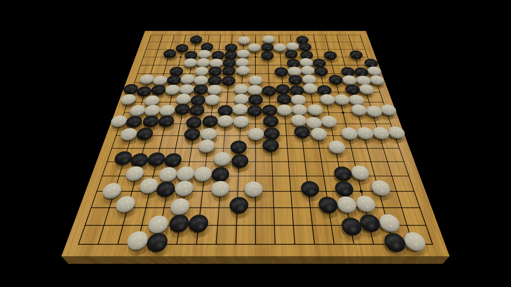

# render-go

This project is a script for rendering Go games in a realistic way, inspired by [Niclas Mattsson](https://senseis.xmp.net/?NaturalStonePlacement). It uses Node.js and POV-Ray and can render a .sgf game record into a series of images, one per move. See [goban.mp4](goban.mp4) for an example.

